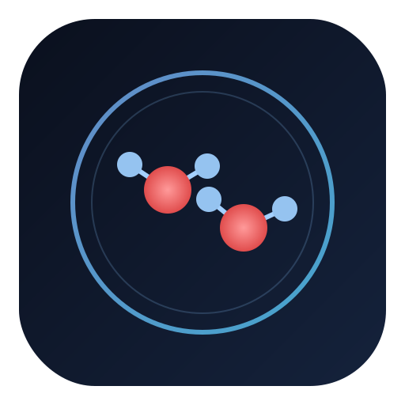

# Material Sim

A browser-based material simulator built with TypeScript, and WebGPU.  
It renders and simulates atoms, molecules, ions, and polymers using GPU compute shaders.

Demo:
https://matthi1993.github.io/material-sim/




## Run locally

```bash
npm install
npm run dev
```

## Build for production

```bash
npm run build
npm run preview
```
